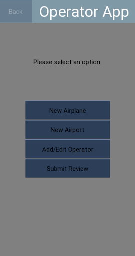
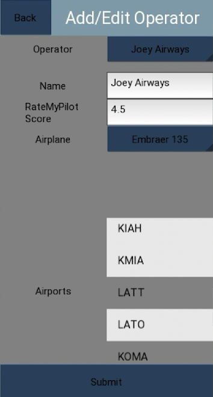
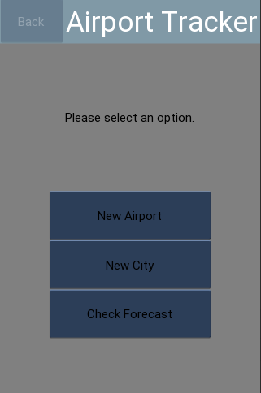
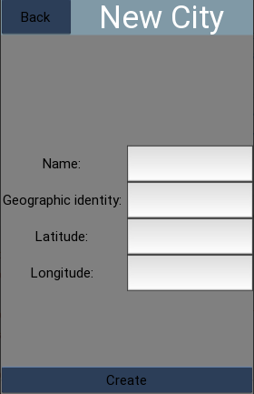
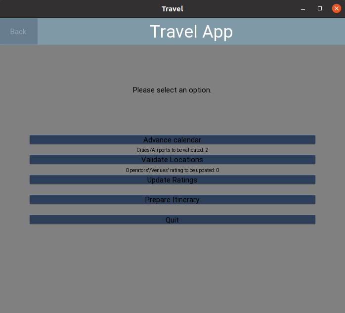
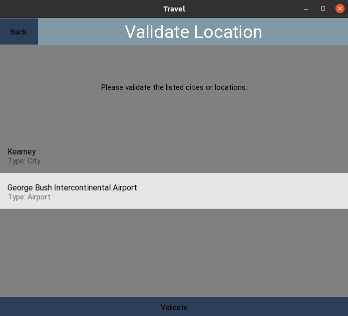

# Cornhusker Travel App
<!-- TABLE OF CONTENTS -->

  
Table of Contents

  <ol>
    <li>
      <a href="#about-the-project">About The Project</a>
      <ul>
        <li><a href="#authors">Authors</a></li>
        <li><a href="#built-with">Built With</a></li>
      </ul>
    </li>
    <li><a href="#usage">Usage</a>
       <ul>
        <li><a href="#operator-tracker-app">Operator Tracker App</a></li>
         <li><a href="#airport-tracker-app">Airport Tracker App</a></li>
         <li><a href="#installer">Installer</a></li>
         <li><a href="#travel-planner-app">Travel Planner App</a></li>
      </ul>
    </li>
    <li><a href="#software-architecture">Software Architecture</a></li>
    <li><a href="#testing-and-test-results">Testing</a></li>
  </ol>

## About The Project
This project involves the development of several mobile and desktop applications designed to assist in travel planning and coordination. In the initial phase, students will individually prototype a mobile app and create a corresponding MySQL database to store collected data. Subsequently, teams will collaborate to extend two existing mobile apps, update them to meet new requirements, and design a combined database. The combined database will be hosted on a remote server, and a desktop installer will be created to set up and populate it. Additionally, a desktop app will be developed to plan specific travel experiences by integrating data from OpenWeather and user input. 

(<a href="#readme-top">back to top</a>)

### Authors
*   Christian Tietz
*   Hamdan Sayeed
*   Luke Stevens
*   Nga Pham 
*   Sam Woods
*   Hamdan Sayeed

(<a href="#readme-top">back to top</a>)

  
### Built With
* [Python](https://www.python.org/)
* [OpenWeather REST connector](https://git.unl.edu/soft-core/soft-160/openweather-rest-and-file-connector)
* [Kivy](https://kivy.org/#home)
* [KivyMD](https://kivymd.readthedocs.io/en/latest/)
* [MySQL](https://www.mysql.com/)

(<a href="#readme-top">back to top</a>)

## Usage
### Operator Tracker App

* Description: Create and edit operators and airplanes along with submitting reviews for an operator.
* Known Bugs: No known bugs
* How to use:
  1. Add a new file to the respository called 'credentials.json' and
  2. add the following fields followed by a colon and specific values:
"Database Authority", "Database Port", "Database Name", "Database Username", "Database Password", "OpenWeather Authority", "OpenWeather Port".
  3. Run second_tracking_app/main.py

(<a href="#readme-top">back to top</a>)

### Airport Tracker App

* Description: Create and edit cities and airports and check forecasts for an airport on a certain day.
* Known Bugs: No known bugs
* How to use:
  1. Add a new file to the respository called 'credentials.json' and
  2. add the following fields followed by a colon and your specific values:"Database Authority", "Database Port", "Database Name", "Database Username", "Database Password", "OpenWeather Authority", "OpenWeather Port".
  3. Run first_tracking_app/airport_tracker_app.py

(<a href="#readme-top">back to top</a>)

### Installer
* Description: Populates the database with starter data.
* Known Bugs: No known bugs
* How to use: Drop all of the tables currently in the database, then run installer/installer.py

(<a href="#readme-top">back to top</a>)

### Travel Planner App

* Description: Allows a travel agent to manage a database shared by the mobile apps, validate data collected by the mobile apps, and to prepare itineraries for travelers.
* Known Bugs: Prepare Itinerary function exists and is tested, but a bug exists when trying to implement it to GUI.
* How to use:
  1. Run travel_planner_app/main.py.
  2. Fill in your credetials to enter the main menu.

(<a href="#readme-top">back to top</a>)

## Software Architecture

* All three applications (<a href="#operator-tracker-app">Operator Tracker App</a>, <a href="#airport-tracker-app">Airport Tracker App</a>, <a href="#travel-planner-app">Travel Planner App</a>) used a common database for data transfer.
* The database is prepoulated with hard-coded values in the installer(when the installer is run).
* For the GUI, all three application inherits many custom elements, features and methods from a common `tracker_app.py` and `custom_widgets.kv`.

(<a href="#readme-top">back to top</a>)

## Testing and Test Results
The majority of database-interacting functions have undergone comprehensive testing, and their code coverage metrics have been collected.
* More details: [Travel Planner System Test](/TravelPlanner_system_test.md)
